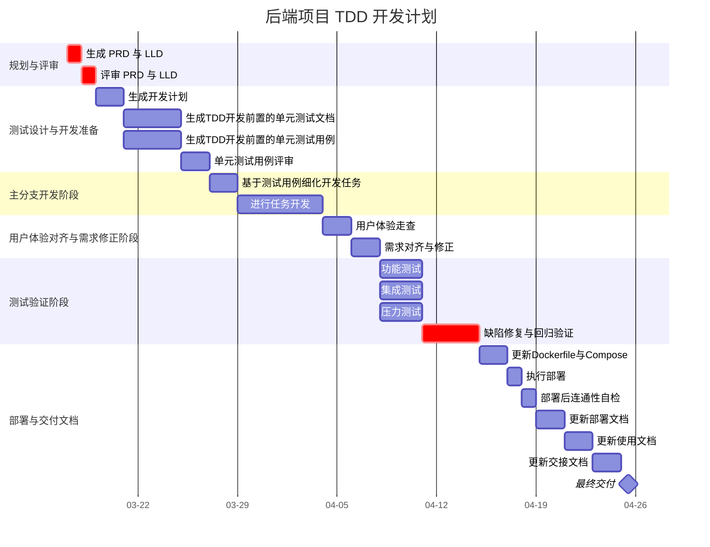

# GANTT

## 项目任务清单

### 规划与评审
- [x] 生成 PRD 与 LLD
- [x] 评审 PRD 与 LLD

### 测试设计与开发准备
- [x] 生成开发计划
- [x] 生成TDD开发前置的单元测试文档
- [x] 生成TDD开发前置的单元测试用例
- [x] 单元测试用例评审

### 主分支开发阶段
- [x] 基于单元测试用例细化开发任务
- [x] 进行任务开发

### 用户体验对齐与需求修正阶段
- [ ] 用户体验走查(启动开发环境,让用户(人类)体验,使用,反馈)
- [ ] 需求对齐与修正

### 测试验证阶段
- [ ] 编写测试文档
- [ ] 功能测试
- [ ] 集成测试
- [ ] 压力测试
- [ ] 缺陷修复与回归验证

### 部署与交付文档
- [x] 更新Dockerfile与Compose
- [ ] 执行部署
- [ ] 部署后连通性自检
- [x] 更新部署文档
- [x] 更新使用文档
- [x] 更新交接文档
- [ ] 最终交付
